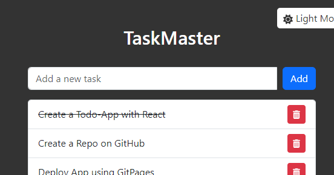

# Task Masters ✔️ 
TaskMaster is a To-Do application built using React. It allows users to create a list of tasks they need to complete. Additionally, the app features a Dark Mode that changes the visual style of the entire app, providing a more comfortable experience in low-light conditions.

## How it works
You can add tasks, mark them as completed (by clicking on the text once), and remove them.

## Languages
* HTML5
* CSS3
* Javascript ES6

## What i used
* [React](https://react.dev/)
* [Node.js](https://nodejs.org/it)
* [Bootstrap](https://getbootstrap.com/) as an HTML and CSS framework I have opted for.

## Installation
First of all, you need Node.js installed.
If you don't have it, you can download it here:
[Node.js](https://nodejs.org/it/download/) 

### 1 - Clone the repository
`git clone https://github.com/R3ddy95/BookHunters.git`
### 2 - Install the dependencies
`npm install`
### 3 - Build it!
`npm run build`

### 4 - Open in the browser
'npm start' and go to [http://localhost:3000](http://localhost:3000) to view it in your browser.

##  Try it!
Elsewhere, you can simply try it here:
[TaskMaster](https://taskmaster-f1c28.web.app/)

##  License
[MIT](https://choosealicense.com/licenses/mit/)

## Contact Me
My Email: edoardo.vitagliano3@gmail.com  
You can find my Linkedin profile here: https://www.linkedin.com/in/edoardo-vitagliano-299737110/
